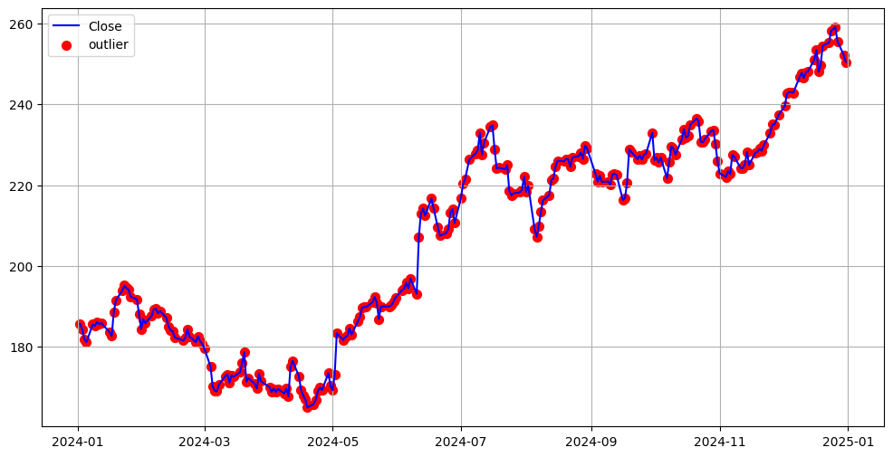

# Stock Data Analysis Project

## 1. Mục tiêu
Dự án này nhằm khai thác, làm sạch và phân tích dữ liệu giá cổ phiếu (stock data) từ file CSV thô. Mục tiêu là:
- Xử lý dữ liệu thô, chuẩn hóa cột ngày tháng.
- Xác định các giá trị bất thường (outlier) của các cột giá và Volume.
- Quan sát các khoảng thời gian có biến động mạnh và trực quan hóa dữ liệu.

---

## 2. Dữ liệu
- File CSV thô bao gồm các cột:
  - `Unnamed: 0` → ngày giao dịch
  - `Open`, `High`, `Low`, `Close`, `Adj Close` → giá cổ phiếu
  - `Volume` → khối lượng giao dịch

---

## 3. Các bước xử lý dữ liệu

### 3.1 Chuẩn hóa cột ngày tháng
- Chuyển `Unnamed: 0` thành cột `Date`.
- Đặt cột `Date` làm index và convert sang `datetime`.
- Kết quả: DataFrame có index là ngày và các cột giá, Volume.

```python
stock['Date'] = pd.to_datetime(stock['Unnamed: 0'])
stock = stock.set_index('Date')
```

### 3.2 Kiểm tra giá trị bất thường (Outlier)
- Sử dụng thống kê cơ bản: min, max, Q1, Q3, IQR.
- Xác định giá trị bất thường 
Outlier < Q1 - 1.5*IQR hoặc Outlier > Q3 + 1.5*IQR
- Thêm các cột `_flag` đánh dấu `Nomal` hoặc `Outlier` cho từng cột giá và Volume.

```python
# Ví dụ cho cột Close
stock['Close_flag'] = stock['Close'].apply(lambda x: 'Outlier' if (x < Q1 - 1.5*IQR or x > Q3 + 1.5*IQR) else 'Normal')
```
### 3.3 Phân tích khoảng thời gian giá biến động mạnh
- Lọc các dòng Close Outlier
```python
outlier_close = stock_flagged[stock_flagged['Close_flag']=='Outlier']
```
- Nhóm theo năm/tháng để biết giai đoạn biến động nhiều nhất:
```python
outlier_2024 = stock_flagged[stock_flagged.index.year==2024]
outlier_per_month = outlier_2024[outlier_2024['Close_flag']=='Outlier'].groupby(outlier_2024.index.month).size()
```
### 3.4 Trực quan hóa dữ liệu
- Vẽ biểu đồ giá Close với các ngày Outlier đánh dấu đỏ:
```python
import matplotlib.pyplot as plt

plt.figure(figsize=(12,6))
plt.plot(stock_2024.index, stock_2024['Close'], label='Close', color='blue')
plt.scatter(outlier_2024.index, outlier_2024['Close'], color='red', label='Outlier', s=50)
plt.title('Close price năm 2024 với các ngày Outlier')
plt.xlabel('Date')
plt.ylabel('Close')
plt.legend()
plt.grid(True)
plt.show()
```
- Biểu đồ thu được



